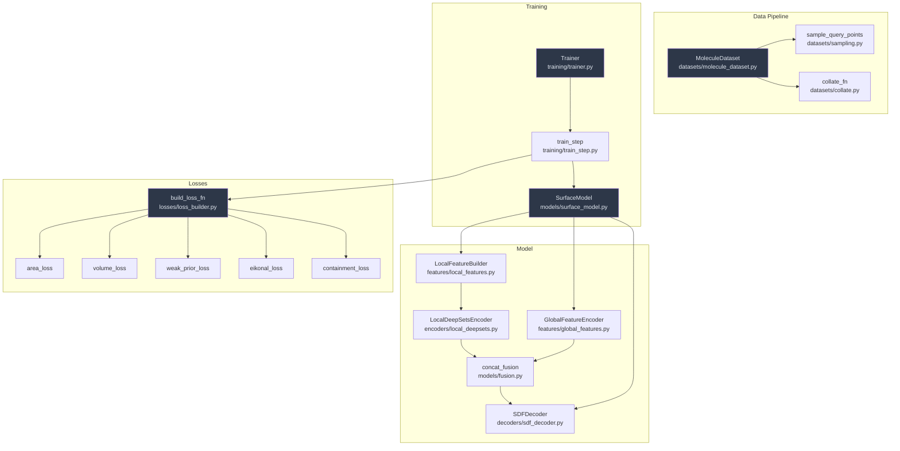
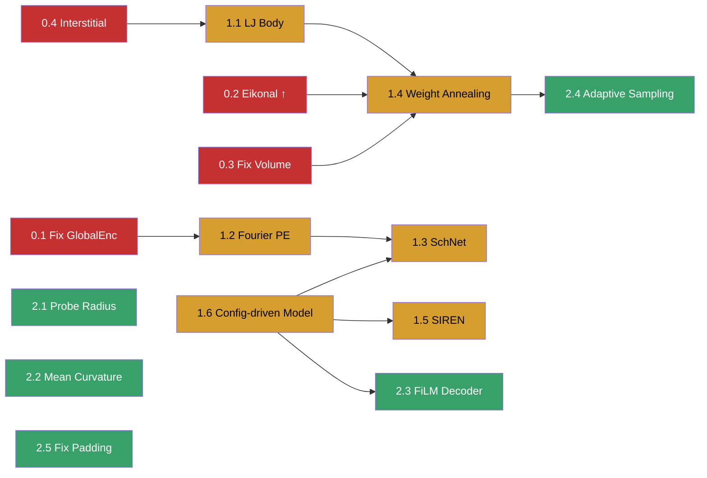

# Neural-VISM 工程实施计划

> 基于 `methodology_evaluation.md` 的研究评审，拆解为可执行的工程任务。
> **原则：先保证训练可跑通，再逐步引入物理项。**

---

## 现有代码库概览



### 关键现状

| 模块 | 状态 | 主要问题 |
|---|---|---|
| `SurfaceModel` | 可运行 | 全局编码器使用绝对坐标（破坏平移不变性） |
| `SDFDecoder` | 可运行 | 仅 3 层 SiLU MLP，无 skip connection，无位置编码 |
| `LocalDeepSetsEncoder` | 可运行 | 无邻居间交互，几何表达力不足 |
| `FiLMDecoder` | 存在但未接入 | 与 `SurfaceModel` 断开 |
| `LocalEGNNEncoder` | 存在但为 stub | TODO 未实现 |
| Loss 系统 | 可运行 | 缺 LJ body integral、mean curvature；volume loss 物理意义错误 |
| 采样 | 可运行 | 全局占比过高（50%），无重要性采样，凹区欠采样 |
| 训练循环 | 可运行 | 无 loss weight annealing，无学习率调度，无 wandb/tensorboard 日志 |
| Config 系统 | 可运行 | 无 model config 解析（`SurfaceModel` 硬编码参数） |

---

## 🔴 P0 — 关键修复（训练能跑且不崩溃）

### Task 0.1: 修复全局编码器的平移不变性

| | |
|---|---|
| **目标** | 消除绝对坐标导致的平移不变性破坏 |
| **修改文件** | [global_features.py](file:///Users/ruyu/code/nerual-vism/src/biomol_surface_unsup/features/global_features.py) |
| **具体改动** | L30：`coords` → `coords - center_of_mass`，质心由 `atom_mask` 加权计算 |
| **输入** | `coords [B,N,3]`, `atom_mask [B,N]` |
| **输出** | 接口不变，内部使用相对坐标 |
| **依赖** | 无，独立可做 |
| **风险** | 🟢 极低。单行修改，不影响下游维度。需确认 `atom_mask` 加权正确处理 padding |
| **测试** | 平移前后 global embedding 应相同（`test_model_forward.py` 加 case） |

---

### Task 0.2: 提升 Eikonal 权重 + 切换为 L1

| | |
|---|---|
| **目标** | 防止 area loss 通过 ∥∇φ∥→0 逃逸；保证 φ 是真正的 SDF |
| **修改文件** | ① [configs/loss/vism_lite.yaml](file:///Users/ruyu/code/nerual-vism/configs/loss/vism_lite.yaml) ② [eikonal.py](file:///Users/ruyu/code/nerual-vism/src/biomol_surface_unsup/losses/eikonal.py) ③ [utils/config.py](file:///Users/ruyu/code/nerual-vism/src/biomol_surface_unsup/utils/config.py) |
| **具体改动** | ① yaml: `weight: 0.1` → `weight: 0.5` ② eikonal: `.pow(2)` → `.abs()` ③ config: `DEFAULT_LOSS_WEIGHTS["eikonal"]` → `0.5` |
| **输入/输出** | 接口不变 |
| **依赖** | 无，独立可做 |
| **风险** | 🟡 中低。权重调大可能导致初期训练不稳，需观察 `E[∥∇φ∥]` 指标 |
| **测试** | `test_losses.py` 中 eikonal 测试需更新期望值（L1 vs L2） |

---

### Task 0.3: 替换/移除 Volume Fraction Loss

| | |
|---|---|
| **目标** | 消除物理上无意义的 0.5 体积分数目标 |
| **修改文件** | ① [NEW] [losses/pressure_volume.py](file:///Users/ruyu/code/nerual-vism/src/biomol_surface_unsup/losses/pressure_volume.py) ② [losses/loss_builder.py](file:///Users/ruyu/code/nerual-vism/src/biomol_surface_unsup/losses/loss_builder.py) ③ [losses/__init__.py](file:///Users/ruyu/code/nerual-vism/src/biomol_surface_unsup/losses/__init__.py) ④ [configs/loss/vism_lite.yaml](file:///Users/ruyu/code/nerual-vism/configs/loss/vism_lite.yaml) ⑤ [utils/config.py](file:///Users/ruyu/code/nerual-vism/src/biomol_surface_unsup/utils/config.py) |
| **方案** | 新写 `pressure_volume_loss(pred_sdf, mask, pressure, eps)` → `P · mean(H_ε(φ))`。在 `SUPPORTED_LOSSES` 中用 `"pressure_volume"` 替换 `"volume"`，或同时保留两者并通过 config 切换 |
| **输入** | `pred_sdf [B,Q]`, `mask [B,Q]`, `pressure: float`, `eps: float` |
| **输出** | `scalar loss` |
| **依赖** | 复用 `smooth_heaviside` from `volume.py` |
| **风险** | 🟡 中。`pressure` 超参需物理值域知识（典型水在 300K ≈ 0.0334 kcal/mol/ų）。建议先设很小值 (0.01) 或 weight=0 |
| **测试** | [NEW] `test_pressure_volume_loss` 单元测试 |

> [!IMPORTANT]
> **决策点**：是直接替换 `volume` 还是新增 `pressure_volume` 并保留 `volume` 用于对照？建议保留两者，通过 config 选择，weight=0 关闭不需要的。

---

### Task 0.4: 增加间隙区域 Containment 采样点

| | |
|---|---|
| **目标** | 防止 "气泡坍缩" 失败模式（表面在原子间内缩） |
| **修改文件** | [datasets/sampling.py](file:///Users/ruyu/code/nerual-vism/src/biomol_surface_unsup/datasets/sampling.py) |
| **具体改动** | 在 `sample_query_points` 中，containment 采样除了 atom-centered jitter，额外加入：① 键中点（bond midpoint）：相邻原子对的中间点 ② 凸包内随机点：在所有原子坐标的凸包内均匀采样 |
| **输入** | `coords [N,3]`, `radii [N]`（新增可选：`bond_pairs [E,2]`） |
| **输出** | `containment_points` 数量增加，接口不变 |
| **依赖** | `MoleculeDataset` 需提供 bond_pairs（或由距离阈值自动推断） |
| **风险** | 🟡 中。凸包计算需 `scipy.spatial.ConvexHull`（已是 scikit-image 依赖的间接依赖）。对 ≤3 个原子退化为单纯形需处理边界情况 |
| **测试** | 更新 `test_sampling.py`，验证新 containment 点均在分子内部 |

---

## 🟡 P1 — 重要改进（物理意义 + 模型能力）

### Task 1.1: 实现 LJ Body Integral Loss

| | |
|---|---|
| **目标** | 引入 VISM 的核心物理项：溶质-溶剂 van der Waals 相互作用 |
| **修改文件** | ① [NEW] [losses/lj_body.py](file:///Users/ruyu/code/nerual-vism/src/biomol_surface_unsup/losses/lj_body.py) ② [losses/loss_builder.py](file:///Users/ruyu/code/nerual-vism/src/biomol_surface_unsup/losses/loss_builder.py) ③ [losses/__init__.py](file:///Users/ruyu/code/nerual-vism/src/biomol_surface_unsup/losses/__init__.py) ④ [configs/loss/vism_lite.yaml](file:///Users/ruyu/code/nerual-vism/configs/loss/vism_lite.yaml) ⑤ [utils/config.py](file:///Users/ruyu/code/nerual-vism/src/biomol_surface_unsup/utils/config.py) |
| **函数签名** | `lj_body_integral(pred_sdf, query_points, coords, epsilon_lj, sigma_lj, atom_mask, rho_0, eps_h)` |
| **输入** | `pred_sdf [B,Q]`, `query_points [B,Q,3]`, `coords [B,N,3]`, `epsilon_lj [B,N]`, `sigma_lj [B,N]`, `atom_mask [B,N]`, `rho_0: float`, `eps_h: float` |
| **输出** | `scalar loss` = `ρ₀ · mean(U_LJ(x) · H_ε(φ(x)))` |
| **依赖** | ① 需要数据集提供 `epsilon_lj`, `sigma_lj` per atom → `MoleculeDataset` 和 `collate_fn` 需扩展 ② 复用 `smooth_heaviside` |
| **风险** | 🟡 中。LJ 势在 r→0 发散，需 `clamp_min` 截断。大分子上 `[B,Q,N]` 中间张量可能 OOM（Q=512, N=1000 → 0.5M entries/sample） |
| **测试** | [NEW] `test_lj_body_loss` — 验证对已知球体的 LJ integral 数值正确性 |

> [!WARNING]
> **数据依赖**：当前 toy dataset 没有 `epsilon_lj` / `sigma_lj`。需要先在 `MoleculeDataset.__getitem__` 中生成 toy 值（从 atom_type 映射），或等 P2 阶段真实数据集就绪。建议先用 toy 映射表。

---

### Task 1.2: 为 SDF Decoder 添加 Fourier / 位置编码

| | |
|---|---|
| **目标** | 让 decoder 能表示高频表面细节；当前 query 坐标仅通过 neighbor 距离间接进入 |
| **修改文件** | ① [NEW] [models/positional_encoding.py](file:///Users/ruyu/code/nerual-vism/src/biomol_surface_unsup/models/positional_encoding.py) ② [models/surface_model.py](file:///Users/ruyu/code/nerual-vism/src/biomol_surface_unsup/models/surface_model.py) ③ [models/decoders/sdf_decoder.py](file:///Users/ruyu/code/nerual-vism/src/biomol_surface_unsup/models/decoders/sdf_decoder.py) |
| **具体改动** | 新建 `FourierEncoder(d_in=3, n_freq=6)` → `d_out = 3*(2*6+1) = 39`。在 `SurfaceModel.forward` 中 `z = concat(z_local, z_global, fourier(query_pos))`。`SDFDecoder.in_dim` 从 256 → 256+39=295 |
| **输入** | `query_points [B,Q,3]` |
| **输出** | 编码后 `[B,Q,39]`，拼接进 decoder 输入 |
| **依赖** | 需同步修改 `SurfaceModel.__init__` 中 decoder 的 `in_dim` |
| **风险** | 🟢 低。维度变化明确，不影响其他模块 |
| **测试** | 更新 `test_model_forward.py` 验证输出 shape 不变 |

> [!TIP]
> **设计决策**：Fourier 编码应对 query 的**相对坐标**（相对于分子质心）进行编码，而非绝对坐标，保持平移不变性。

---

### Task 1.3: 替换 DeepSets 为 SchNet-style 连续滤波卷积

| | |
|---|---|
| **目标** | 捕获邻居间交互，提升口袋/凹区几何识别能力 |
| **修改文件** | ① [NEW] [models/encoders/schnet_encoder.py](file:///Users/ruyu/code/nerual-vism/src/biomol_surface_unsup/models/encoders/schnet_encoder.py) ② [models/surface_model.py](file:///Users/ruyu/code/nerual-vism/src/biomol_surface_unsup/models/surface_model.py) ③ [configs/model/schnet.yaml](file:///Users/ruyu/code/nerual-vism/configs/model/schnet.yaml) |
| **架构** | `ContinuousFilterConv`: `filter_net(rbf) → W`, `messages = h * W`, `sum → update MLP`。堆叠 2-3 层 |
| **输入** | 与 `LocalDeepSetsEncoder` 相同：`features [B,Q,K,F]`, `mask [B,Q,K]`。额外使用 `neighbor_distances [B,Q,K]` 的 RBF 展开 |
| **输出** | `z_local [B,Q,out_dim]`，接口与 DeepSets 完全兼容 |
| **依赖** | ① 需要 `LocalFeatureBuilder` 输出的 RBF 特征（已存在） ② `SurfaceModel` 需支持通过 config 切换 encoder |
| **风险** | 🟡 中。消息传递增加计算量（大约 2-3x）。需保证 mask 处理正确避免泄漏 padding 信息 |
| **测试** | [NEW] `test_schnet_encoder.py` — shape + 置换不变性验证 |

---

### Task 1.4: 实现 Loss Weight Annealing

| | |
|---|---|
| **目标** | 支持两阶段训练：Phase 1（几何初始化）→ Phase 2（物理优化） |
| **修改文件** | ① [NEW] [training/loss_scheduler.py](file:///Users/ruyu/code/nerual-vism/src/biomol_surface_unsup/training/loss_scheduler.py) ② [training/trainer.py](file:///Users/ruyu/code/nerual-vism/src/biomol_surface_unsup/training/trainer.py) ③ [losses/loss_builder.py](file:///Users/ruyu/code/nerual-vism/src/biomol_surface_unsup/losses/loss_builder.py) ④ [configs/loss/vism_lite.yaml](file:///Users/ruyu/code/nerual-vism/configs/loss/vism_lite.yaml) |
| **接口** | `LossWeightScheduler(initial_weights, final_weights, warmup_epochs)` → `.get_weights(epoch) → dict` |
| **调度策略** | Phase 1 (epoch 0→W): `weak_prior=1.0, area=0, volume=0, eikonal=0.5, containment=2.0` → Phase 2 (epoch W→end): `weak_prior→0, area→1.0, pressure_volume→0.5, eikonal=0.5, lj→λ` |
| **依赖** | `build_loss_fn` 需支持外部传入动态权重（当前硬编码在闭包中） |
| **风险** | 🟡 中。`build_loss_fn` 返回闭包，权重在构建时固定。需重构为接受 `weights_dict` 参数 |
| **测试** | [NEW] `test_loss_scheduler.py` — 线性插值正确性 |

---

### Task 1.5: 使用 SIREN 激活函数替换 SDF Decoder

| | |
|---|---|
| **目标** | 提升 SDF 对尖锐表面特征的表示能力 |
| **修改文件** | ① [NEW] [models/decoders/siren_decoder.py](file:///Users/ruyu/code/nerual-vism/src/biomol_surface_unsup/models/decoders/siren_decoder.py) ② [models/surface_model.py](file:///Users/ruyu/code/nerual-vism/src/biomol_surface_unsup/models/surface_model.py) |
| **架构** | `SirenLayer(in, out, ω₀)`: `sin(ω₀ · Linear(x))`，Sitzmann 初始化。最后一层用线性激活 |
| **输入/输出** | 与 `SDFDecoder` 完全相同：`z [B,Q,D] → sdf [B,Q]` |
| **依赖** | 需 `SurfaceModel` 通过 config 切换 decoder |
| **风险** | 🟡 中。SIREN 对初始化和 `ω₀` 敏感。`ω₀=30` 是标准选择，但输入分布不同可能需调整 |
| **测试** | 验证 `SirenDecoder` forward shape + 梯度存在性 |

---

### Task 1.6: 配置驱动的模型构建

| | |
|---|---|
| **目标** | `SurfaceModel` 当前硬编码所有子模块参数，需改为 config 驱动以支持 encoder/decoder 切换 |
| **修改文件** | ① [models/surface_model.py](file:///Users/ruyu/code/nerual-vism/src/biomol_surface_unsup/models/surface_model.py) ② [training/trainer.py](file:///Users/ruyu/code/nerual-vism/src/biomol_surface_unsup/training/trainer.py) ③ [configs/model/](file:///Users/ruyu/code/nerual-vism/configs/model/) 各 yaml |
| **接口** | `SurfaceModel.from_config(model_cfg: dict) → SurfaceModel` |
| **依赖** | Task 1.3 (SchNet encoder) 和 Task 1.5 (SIREN decoder) 需要此基础设施 |
| **风险** | 🟢 低。标准 registry/factory 模式 |
| **测试** | 验证从各 yaml 文件能成功构建模型 |

---

## 🟢 P2 — 锦上添花

### Task 2.1: 添加 Probe Radius 到表面定义

| | |
|---|---|
| **修改文件** | [features/local_features.py](file:///Users/ruyu/code/nerual-vism/src/biomol_surface_unsup/features/local_features.py), [losses/weak_prior.py](file:///Users/ruyu/code/nerual-vism/src/biomol_surface_unsup/losses/weak_prior.py), [datasets/sampling.py](file:///Users/ruyu/code/nerual-vism/src/biomol_surface_unsup/datasets/sampling.py) |
| **改动** | 在构建 neighbor features 和 atomic union 时 `radii = radii + r_probe`（默认 1.4 Å） |
| **依赖** | 无 |
| **风险** | 🟢 低。但会改变 weak_prior target，需重新调权重 |

---

### Task 2.2: 实现 Mean Curvature Loss

| | |
|---|---|
| **修改文件** | ① [NEW] [losses/curvature.py](file:///Users/ruyu/code/nerual-vism/src/biomol_surface_unsup/losses/curvature.py) ② [losses/loss_builder.py](file:///Users/ruyu/code/nerual-vism/src/biomol_surface_unsup/losses/loss_builder.py) |
| **接口** | `mean_curvature_loss(pred_sdf, query_points, mask, eps, gamma_tau)` |
| **依赖** | 需要二阶导数（Hessian of φ），计算代价高 |
| **风险** | 🔴 高。`torch.autograd.grad` 嵌套调用内存压力大，可能需 chunk 计算 |

---

### Task 2.3: 接入 FiLM Decoder

| | |
|---|---|
| **修改文件** | [models/surface_model.py](file:///Users/ruyu/code/nerual-vism/src/biomol_surface_unsup/models/surface_model.py) |
| **改动** | 通过 config `decoder.type: "film"` 使用 `FiLMDecoder(local_dim, global_dim, hidden_dim)` 替换 concat+MLP |
| **依赖** | Task 1.6（config 驱动） |
| **风险** | 🟢 低 |

---

### Task 2.4: 自适应 Surface-Band 采样

| | |
|---|---|
| **修改文件** | [datasets/sampling.py](file:///Users/ruyu/code/nerual-vism/src/biomol_surface_unsup/datasets/sampling.py), [training/train_step.py](file:///Users/ruyu/code/nerual-vism/src/biomol_surface_unsup/training/train_step.py) |
| **改动** | 训练时用当前模型的 SDF 预测引导采样：在 φ(x)≈0 附近密集采样 |
| **依赖** | 需要 model inference 在 sampling 阶段可用（耦合 model 和 data pipeline） |
| **风险** | 🟡 中。增加训练时间；需解耦采样和前向传播的计算图 |

---

### Task 2.5: 修复 Padding Atoms 位置

| | |
|---|---|
| **修改文件** | [datasets/collate.py](file:///Users/ruyu/code/nerual-vism/src/biomol_surface_unsup/datasets/collate.py) |
| **改动** | padding 坐标填充为 `1e6` 而非 `0.0`，避免 `torch.cdist` 误将 padding atoms 视为近邻 |
| **依赖** | 无 |
| **风险** | 🟢 低。但需验证 `masked_fill` 在下游是否仍然正确工作 |

---

## 依赖关系图



---

## 最小可运行版本（MVP）实施顺序

> 目标：**用最少改动让训练循环产生物理上有意义的表面**

```
Step 1 ─── Task 0.1: Fix GlobalEncoder (平移不变性)
  │         ≈ 10 行改动，0 新文件
  │
Step 2 ─── Task 0.2: Eikonal weight ↑ + L1
  │         ≈ 5 行改动，0 新文件
  │
Step 3 ─── Task 0.3: Replace volume loss
  │         ≈ 30 行新代码 + 10 行改动，1 新文件
  │
Step 4 ─── Task 0.4: Interstitial containment
  │         ≈ 40 行改动，0 新文件
  │
  ├── 🟢 Checkpoint: smoke test + 2-epoch toy training
  │   验证: loss 下降、∥∇φ∥ ≈ 1.0、无 NaN
  │
Step 5 ─── Task 1.2: Fourier positional encoding
  │         ≈ 30 行新代码 + 15 行改动，1 新文件
  │
Step 6 ─── Task 1.4: Loss weight annealing
  │         ≈ 50 行新代码 + 20 行改动，1 新文件
  │
Step 7 ─── Task 1.1: LJ body integral
  │         ≈ 60 行新代码 + 30 行改动，1 新文件
  │
  ├── 🟢 Checkpoint: VISM-lite 可运行
  │   验证: LJ loss 有梯度、两阶段训练跑通
  │
  ┌── (后续可并行)
  │
Step 8 ─── Task 1.6: Config-driven model
Step 9 ─── Task 1.3: SchNet encoder
Step 10 ── Task 1.5: SIREN decoder
```

### 每步的 验证标准

| Step | 通过标准 |
|---|---|
| Step 1 | `pytest -q` 全绿 + 新增平移不变性测试通过 |
| Step 2 | `pytest -q` 全绿 + smoke test 中 `E[∥∇φ∥]` ∈ [0.8, 1.2] |
| Step 3 | `pytest -q` 全绿 + `pressure_volume` loss 在 toy data 上不为零 |
| Step 4 | `pytest -q` 全绿 + containment 点覆盖键中点 |
| Step 5 | `pytest -q` 全绿 + model forward shape 正确 |
| Step 6 | `pytest -q` 全绿 + phase 1→2 权重正确插值 |
| Step 7 | `pytest -q` 全绿 + LJ loss 在 toy data 上有限且有梯度 |

---

## User Review Required

> [!IMPORTANT]
> **以下两个设计决策需要你的意见：**
>
> 1. **Volume Loss 策略**：是直接替换 `volume_loss` 为 `pressure_volume_loss`（破坏旧 config 兼容性），还是两者共存通过 config `type` 字段切换？
>
> 2. **LJ 参数来源**：当前 toy dataset 没有 `epsilon_lj` / `sigma_lj`。MVP 阶段是否接受从 `atom_type` 硬编码映射（如 C→ε=0.086/σ=1.7, N→ε=0.17/σ=1.55 等 AMBER 力场值），还是要等真实数据集集成？

## Open Questions

> [!WARNING]
> **Pressure 超参**：`pressure_volume_loss` 中的 `pressure` 参数应取什么物理量级？纯水 at 300K 约为 0.0334 kcal/mol/ų，但在 loss 中可能需要缩放。是否有偏好的能量单位体系？

> [!NOTE]
> **关于 SchNet vs EGNN**：代码中已有 `LocalEGNNEncoder` stub。在 Task 1.3 中我计划实现 SchNet-style 而非完善 EGNN。SchNet 更简单且足以捕获距离依赖交互。如果你更偏好 EGNN（equivariant），请告知。

---

## Verification Plan

### Automated Tests

每个 Task 完成后运行：
```bash
pytest -q
python scripts/smoke_test.py
```

MVP Checkpoint（Step 4 后）额外运行：
```bash
# 2-epoch toy training，验证 loss 下降
python -c "
from biomol_surface_unsup.training.trainer import Trainer
cfg = {
    'data': {'num_samples': 4, 'num_atoms': 4, 'num_query_points': 64, 'bbox_padding': 2.0},
    'train': {'batch_size': 2, 'epochs': 2, 'lr': 1e-3, 'weight_decay': 1e-5, 'device': 'cpu'},
    'loss': {},
}
trainer = Trainer(cfg)
trainer.train()
"
```

### Manual Verification

- Step 7 后：导出 toy 分子 mesh（marching cubes），目视检查表面质量
- 长期：对比 MSMS 生成的 SES 表面
