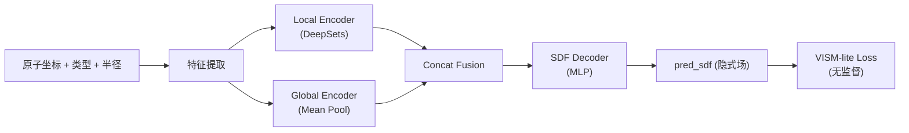

# Neural VISM — 项目全景分析

## 一、项目是什么？

**biomol_surface_unsup** 是一个**无监督神经隐式生物分子表面学习**项目。

核心思想：给定一个分子的原子坐标、原子类型和原子半径，用神经网络学习一个**标量隐式场（SDF）**来表示该分子的溶剂可及表面（Solvent-Accessible Surface），且**不依赖标注的 ground-truth 表面**（无监督）。

它的理论基础来自 **VISM（Variational Implicit Solvation Model）** 的简化版 "VISM-lite"，通过一组物理驱动的变分目标函数来约束表面的几何合理性。



## 二、整体架构

### 2.1 数据流

| 阶段 | 输入 | 输出 | 状态 |
|------|------|------|------|
| 数据预处理 | 分子文件 (PDB/SDF) | coords, atom_types, radii | ❌ 仅 stub |
| 查询点采样 | coords + radii | 分层采样点 (global/containment/surface_band) | ✅ 已完成 |
| 特征构建 | coords + query_points | 局部邻居特征 [B,Q,K,F] | ✅ 已完成 |
| 模型前向 | 特征 → Encoder → Decoder | pred_sdf [B,Q] | ✅ 已完成 |
| 损失计算 | pred_sdf + query_groups | VISM-lite 复合损失 | ✅ 已完成 |
| 训练循环 | DataLoader + Model + Loss | checkpoint | ⚠️ 基本可用，缺评估/日志 |
| 评估 | checkpoint + 测试数据 | metrics | ❌ 仅 stub |
| Mesh 导出 | SDF grid → Marching Cubes | mesh (.obj/.ply) | ❌ 仅 stub |

### 2.2 核心模块清单

```
src/biomol_surface_unsup/
├── datasets/           # 数据与采样
│   ├── molecule_dataset.py   ✅ Toy Dataset（合成数据，可变原子数）
│   ├── sampling.py           ✅ 分层查询点采样（global / containment / surface_band）
│   ├── collate.py            ✅ 带 padding & mask 的 batch collation
│   └── transforms.py         ❌ 空文件
├── features/           # 特征工程
│   ├── local_features.py     ✅ LocalFeatureBuilder（邻居搜索 + RBF + 嵌入）
│   ├── global_features.py    ✅ GlobalFeatureEncoder（原子嵌入 → mean pool）
│   ├── atom_features.py      ✅ AtomFeatureEmbedding
│   └── neighbor_search.py    ⚠️ 简单实现
├── models/             # 网络模型
│   ├── surface_model.py      ✅ SurfaceModel 主类
│   ├── encoders/
│   │   ├── local_deepsets.py  ✅ DeepSets 编码器
│   │   └── local_egnn.py     ⚠️ Stub（仅 MLP，非真正 EGNN）
│   ├── decoders/
│   │   ├── sdf_decoder.py    ✅ SDF 输出头
│   │   └── film_decoder.py   ✅ FiLM 调制解码器（未接入主模型）
│   └── fusion.py             ✅ Concat 融合
├── losses/             # 损失函数
│   ├── loss_builder.py       ✅ 配置驱动的复合损失
│   ├── weak_prior.py         ✅ 弱先验（对齐原子并球近似）
│   ├── containment.py        ✅ 包含性约束
│   ├── eikonal.py            ✅ Eikonal 正则化
│   ├── area.py               ✅ 面积正则化（smooth delta）
│   ├── volume.py             ✅ 体积分数约束
│   └── vism_lite.py          ✅ Legacy VISM-lite 包装器
├── training/           # 训练
│   ├── trainer.py            ⚠️ Trainer 基本框架
│   ├── train_step.py         ✅ 单步训练
│   ├── eval_step.py          ❌ TODO stub
│   ├── checkpoint.py         ⚠️ 基本保存/加载
│   ├── optimizer.py          ✅ AdamW
│   └── scheduler.py          ❌ 直接 return None
├── geometry/           # 几何工具
│   ├── sdf_ops.py            ✅ sphere_sdf / smooth_min / atomic_union
│   ├── smooth_union.py       ✅ re-export
│   ├── marching_cubes.py     ❌ TODO stub
│   ├── mesh_metrics.py       ❌ TODO stub
│   └── surface_utils.py      ❌ TODO stub (make_grid_from_bbox)
├── visualization/      # 可视化
│   ├── export_mesh.py        ⚠️ 简陋占位
│   └── plot_slices.py        ❌ 占位
└── utils/
    ├── config.py             ✅ YAML 配置 + 损失归一化
    ├── device.py             ✅ 设备选择
    ├── io.py                 ⚠️ 简单 IO
    ├── logging.py            ⚠️ 简单日志
    └── seed.py               ✅ 随机种子
```

## 三、已完成的核心能力

### ✅ Toy 训练主链路已跑通

smoke_test.py 证明以下流程可以端到端运行：
1. `MoleculeDataset` → 生成合成分子数据（固定坐标）
2. `collate_fn` → 不等长样本 padding 到 batch
3. `SurfaceModel.forward()` → 预测 SDF
4. `build_loss_fn()` → 配置驱动的 5 项损失组合
5. `train_step()` → 反向传播 + 参数更新

### ✅ 采样策略设计合理

三类分层采样已实现：
- **Global**：bbox 均匀采样（用于 volume / eikonal）
- **Containment**：原子中心附近 jitter（用于内部性约束）
- **Surface Band**：窄带采样（用于 area / weak_prior）

### ✅ 损失体系完整

5 个损失项均已实现并可独立配置权重和查询组：

| 损失 | 物理意义 | 默认权重 |
|------|---------|---------|
| `area` | 表面积正则化（鼓励紧凑表面） | 1.0 |
| `volume` | 体积分数匹配 | 0.5 |
| `weak_prior` | 与原子球并的 SDF 对齐 | 0.5 |
| `eikonal` | ∥∇φ∥ ≈ 1（SDF 合法性） | 0.1 |
| `containment` | 原子中心应在表面内部 | 2.0 |

---

## 四、距离正式使用的 Gap 分析

### 🔴 P0 — 缺失关键功能（必须实现才能用于真实实验）

#### 1. 真实数据管线 (`preprocess.py` + `MoleculeDataset`)
- 当前 `MoleculeDataset` 仅返回硬编码的 4 原子 toy 坐标
- `preprocess.py` 是空 stub
- **需要**：解析 PDB/SDF/MOL2 文件 → 提取 coords / atom_types / radii → 保存为 `.pt`
- **需要**：支持从磁盘加载真实分子数据，而不是硬编码

#### 2. Mesh 提取 (`marching_cubes.py` + `surface_utils.py` + `infer_mesh.py`)
- `marching_cubes.py` 是 `return None`
- `make_grid_from_bbox` 是 `return None`
- `infer_mesh.py` 是 `print("TODO")`
- **需要**：网格采样 → 前向推断 → `skimage.measure.marching_cubes` → 导出 `.obj`/`.ply`
- 这是生成最终可视化表面的**唯一路径**，不可或缺

#### 3. 评估流程 (`eval_step.py` + `evaluate.py`)
- `eval_step` 只有 `return {}`
- `Trainer.evaluate()` 只有 `print("TODO")`
- **需要**：验证集评估 + 定量指标（SDF 误差 / 表面质量）

### 🟡 P1 — 重要改进（对实验质量有显著影响）

#### 4. 学习率调度器 (`scheduler.py`)
- 直接 `return None`，训练稳定性无保障
- **建议**：CosineAnnealingLR 或 WarmupCosine

#### 5. 训练日志与监控
- 当前只有 `print(f"epoch=... step=... metrics=...")`
- **建议**：TensorBoard / WandB 日志集成
- **建议**：记录每个 loss 分项的曲线

#### 6. Checkpoint 管理增强
- `save_checkpoint` / `load_checkpoint` 存在但未在 `Trainer` 中调用
- **需要**：训练循环中定期保存，支持 resume training

#### 7. EGNN Encoder (`local_egnn.py`)
- 标记为 TODO，目前只是普通 MLP，没有利用 3D 坐标信息做消息传递
- 对于更大分子，等变网络可能是必要的

#### 8. 定量评估指标 (`mesh_metrics.py`)
- `chamfer_distance` 是 `return 0.0`
- **需要**：Chamfer Distance / Hausdorff / IoU 等指标的真实实现

### 🟢 P2 — 锦上添花（可后期补充）

#### 9. 数据增强 (`transforms.py` — 空文件)
- 分子旋转、平移等增强

#### 10. FiLM Decoder 集成到主模型
- `film_decoder.py` 已实现但 `SurfaceModel` 只用了 `SDFDecoder + concat_fusion`
- FiLM 可能效果更好

#### 11. 可视化改进
- `plot_slices.py` 是空壳
- `export_mesh.py` 只是写了个 str 到文件
- **需要**：SDF 切片可视化 / 3D mesh 渲染

#### 12. 配置驱动的模型构建
- `local_global_unsup.yaml` 定义了模型超参但 `SurfaceModel` 未读取这些配置
- 模型参数仍是硬编码的

---

## 五、按 PLAN.md 的进度评估

| 步骤 | 描述 | 状态 |
|------|------|------|
| 1 | 跑通 toy dataset | ✅ 完成 |
| 2 | 跑通 backward | ✅ 完成 |
| 3 | 加 containment | ✅ 完成 |
| 4 | local/global ablation | ⚠️ 代码结构就绪，但缺日志/评估支撑 |
| 5 | 真实数据 | ❌ 未开始 |

> [!IMPORTANT]
> 项目当前处于 **"toy 主链路跑通"** 阶段（PLAN 第 1-3 步）。核心的神经网络 + 损失函数 + 训练循环已可在合成数据上运行。但距离在真实分子数据上使用，**至少需要完成 P0 的 3 项**（真实数据、mesh 提取、评估流程）。

---

## 六、推荐推进顺序

```
1. 实现 make_grid_from_bbox + marching_cubes → 让 toy 训练后能可视化表面
2. 补全 eval_step 和 Trainer.evaluate → 可以定量观察训练效果
3. Trainer 中集成 checkpoint 保存/加载 + scheduler
4. 实现 preprocess.py → 支持真实 PDB 分子
5. MoleculeDataset 支持从 .pt 文件加载真实数据
6. 补全 mesh_metrics → 定量评估表面质量
7. 集成日志（TensorBoard）
8. 实现 EGNN encoder → 提升表达能力
```

这样可以在每一步都获得可验证的增量进展。
